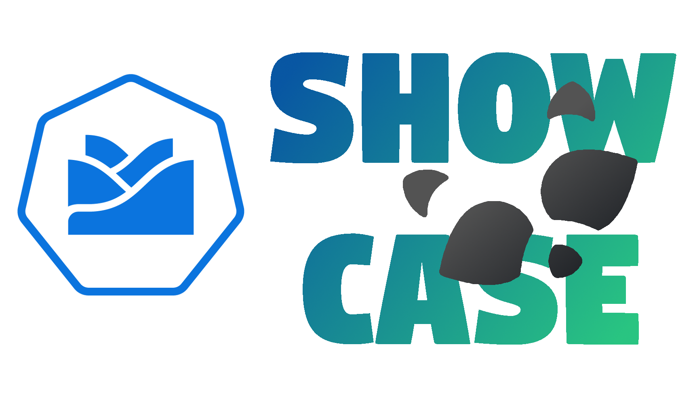

# Kyma Showcase
[](https://goreportcard.com/report/github.com/kyma-incubator/Kyma-Showcase)
[](https://godoc.org/github.com/kyma-incubator/Kyma-Showcase)

## Overview

Kyma Showcase is a project about object recognition relying on GCP API and Serverless Functions Workflow. A customer uploads an image on the front page. Then the image is displayed in the feed. Clicking on any image in the feed redirects you to its details page showing all the information acquired from processing that image. <!--maybe we could add some information examples>

## Prerequisites

- [Kyma](https://kyma-project.io/) cluster
- [kubectl](https://kubernetes.io/docs/tasks/tools/)

## Installation

 To run Kyma Showcase application, follow these steps:

1. Clone the repository:

```bash
git clone https://github.com/kyma-incubator/kyma-showcase.git
```

2. Replace the placeholder values with the name of your cluster domain in the following files:

- [`resources/backend/apirule.yaml`](./resources/backend/apirule.yaml)
- [`resources/frontend/apirule.yaml`](./resources/frontend/apirule.yaml)
- [`resources/frontend/frontend-config.yaml`](./resources/frontend/frontend-config.yaml)

3. Set secrets by replacing the placeholder values in the [`resources/secrets.yaml`](./resources/secrets.yaml) file.

4. Deploy the application on a Kubernetes cluster. Run the following command:

```bash
kubectl apply -f resources -R
```

5. Get the application URL. Run:

```bash
kubectl get apirule frontend -o jsonpath='{.spec.service.host}'
```

## Development

To learn more, read the [Development Guide](./docs/development.md).
